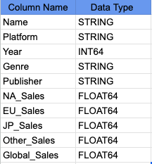
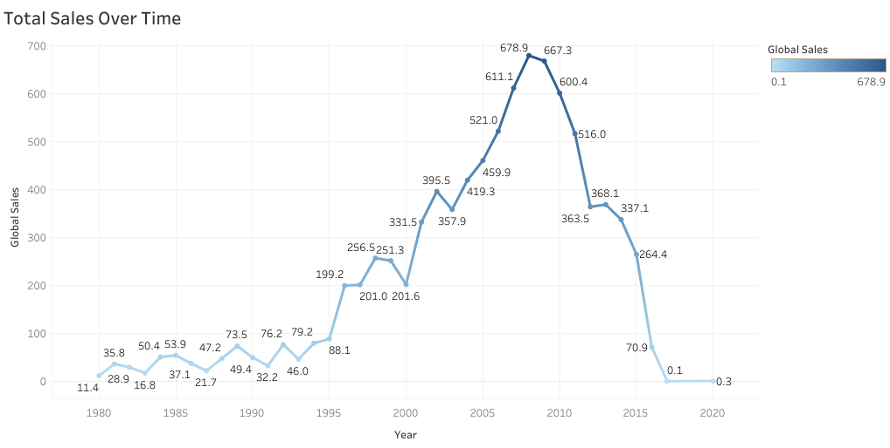
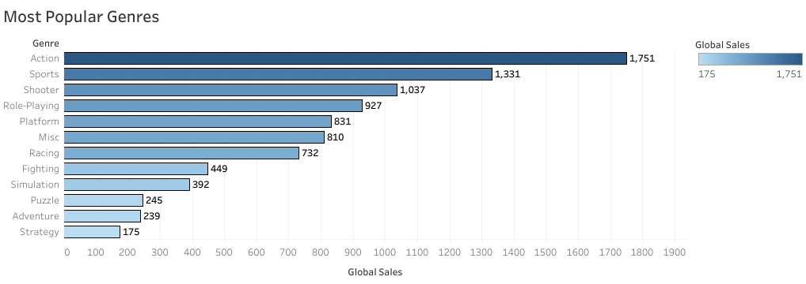
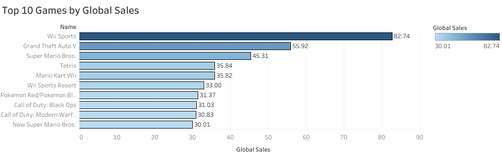
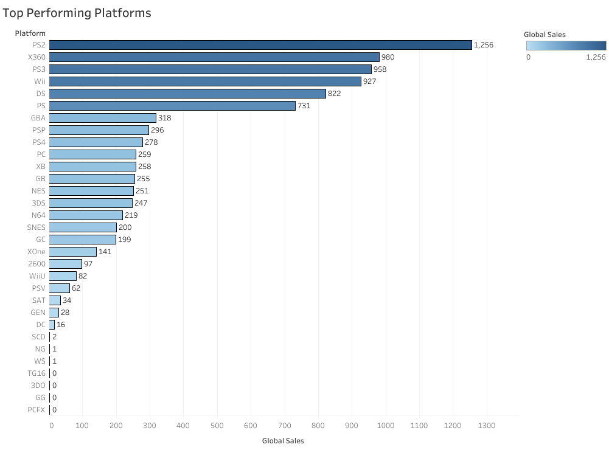
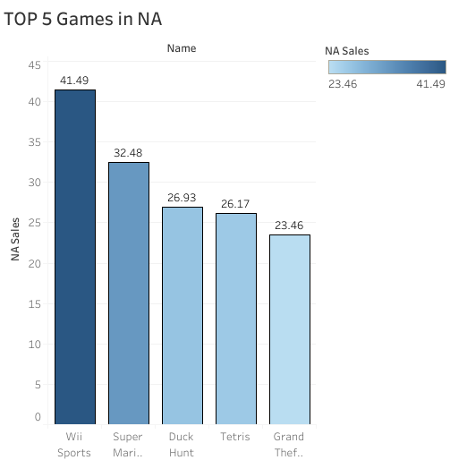
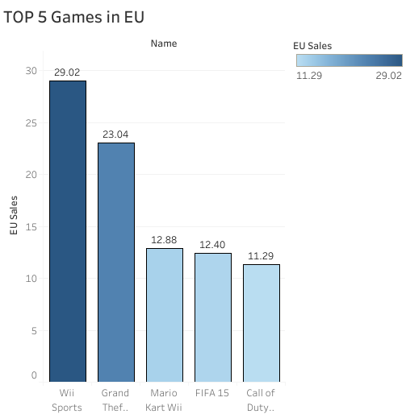
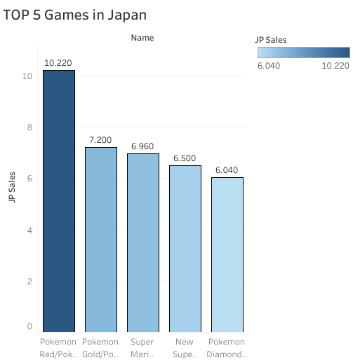
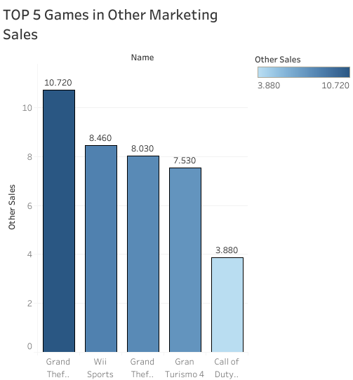

# Project Background

This project investigates an entire historical video game sales database to determine primary trends, market behavior, and geographical tendencies. As a Data Analyst, the task was to provide data-driven information that could be utilized to inform business strategy, game development, and advertising campaigns.

The Tableau dashboard can be seen [here](https://public.tableau.com/views/VideoGameSalesDataAnalysis_17520594940830/TotalSalesOverTime?:language=en-GB&:sid=&:redirect=auth&:display_count=n&:origin=viz_share_link)

The SQL queries to Clean and Prepare the data can be seen [here](sql/Cleaning_and_Preparation.sql)

The SQL queries used to regarding the business questions can be seen [here](sql/Analytical_Queries.sql)

## Key Questions Answered

This analysis addresses several critical business questions, providing a holistic view of the video game market:

1. Top 10 Games by Global Sales: Identification of the best-selling video games worldwide.

2. Total Sales Over Time: Analysis of year-over-year changes in global video game sales to understand market evolution.

3. Most Popular Genres: Determination of genres with the highest total global sales.

4. Top Performing Platforms: Identification of platforms that have generated the most revenue globally.

5. Top 5 Games per Region: Identification of the top 5 best-selling games in North America, Europe, and Japan separately.

## Data Source

The dataset used for this analysis contains historical video game sales information, including game name, platform, release year, genre, publisher, and sales figures across various regions (North America, Europe, Japan, Other, and Global).

**Reference for Market Context:**
    1. Newzoo Insights: [https://newzoo.com/insights](https://newzoo.com/insights) (for general market trends)                                                                       
    2. Statista - Video Games Industry: [https://www.statista.com/markets/423/video-games/](https://www.statista.com/markets/423/video-games/) (for market segment breakdown)        
    3. Article citing 95% digital: [https://universityobserver.ie/](https://universityobserver.ie/the-death-of-physical-games-are-we-living-in-a-discless-world/)

## Data Structure and Initial Checks

You can see down below the dataset structure from the video game sales with a total of 16598 records.

## Executive Summary

On this dataset we can provides a comprehensive data-driven analysis of historical video game sales, offering critical insights into market trends, genre popularity, and regional consumer preferences.

### Some Key Findings

There is a peak in global physical sales around 2008, followed by a sharp decline, a critical indicator of the industry's significant movement for digital distribution (downloads, subscriptions, mobile gaming), which can not be foundin this dataset's scope.

Nintendo demonstrated historical dominance, with its platforms (Wii, DS) and it's strong franchises (Mario, Pokémon) securing numerous top spots globally and particularly in the Japanese market.

Action, Sports, and Shooter emerged as the consistently highest-selling genres worldwide.

In this dataset we can see a diverse regional preferences, with Japan's strong inclination towards Nintendo's exclusive, often more family-friendly titles with Europe and North America having a preference for mature, action-oriented, and sports simulations.

Below you can see the screenshot from the Tableau dashboard. The entire interactive dashboard be seen [here](https://public.tableau.com/views/VideoGameSalesDataAnalysis_17520594940830/TotalSalesOverTime?:language=en-GB&:sid=&:redirect=auth&:display_count=n&:origin=viz_share_link)

### Sales Trends

There's a significant market growth in the early days, with the highest peak in 2008. This period represents the physical retail market's expansion.

The year 2008 stands out as the highest point for global video game sales within this dataset, reaching close to 679 million units sold. This peak coincides with the large adoption of the consoles like Nintendo Wii, PlayStation 3, and Xbox 360.

In this chart, we can see a sharp drop from sales in 2011. This coincides with a dataset limitation, this drop does not represent the decline in the gaming industry as this dataset focus on physical games sales and from this period there's an increase in digital sales specially from 2016 where we can see the lowest numbers in this chart.

With the information from the dataset limitation being said, we can also see a change in demand for a digital sales for this modern video game market.

### The Digital Transformation (From 2010)

From 2010 there is a explosive growth of digital distribution like on PC with Steam Platforms becoming very popular, on consoles with PlayStation Store, Xbox Marketplace, and Nintendo eShop becoming a integrated to the consoles systems offering full game downloads, DLC, and indie titles, the digital sales had a ruge increase with sources indicating that for PlayStation and Xbox, digital sales now account for 70-90% of game sales.

As of 2024, digital formats and related digital products represent more than 95% of the total market value of the video game industry, with physical copies constituting less than 5%.

## TOP Games by Global Sales

Nintendo's strong historical dominance with a solid 8 out of 10 games on this list. This highlights Nintendo's ability to create universally appealing games across multiple console generations (NES, Game Boy, DS, Wii).

We can also see the power of Established Franchises with most of the games in this list being from recognizable brands, it shows that consumers globally prefers games from trusted names.

An emergence for a Multi-Platform action games can also being seen as with names like Grand Theft Auto V and two games from the franchise Call of Duty being in this list shows that the demand for games that can be played in different platforms like PlayStation and Xbox are increasing. 

## Genres Popularity

The Action genre outperforms all other genres in terms of total global sales, with sales notably higher than the second-place Sports genre. This suggests an appeal for games focused on combat, exploration, and dynamic gameplay.

Sports and Shooter genres follow Action with a strong sales numbers, indicating their global popularity. They are also characterized by competitive multiplayer and immersive single-player campaigns.

## Top Performing Platforms 

The top positions held by the consoles (PS2, Xbox 360, PS3 and Wii) are all from the early 2000s to the early 2010s, that represents the peak era for console gaming and physical game sales.

We can also see the PlayStation marketing leadership with the PlayStation 2 being the highest-selling platform and its successor, the PlayStation 3 holding the top 3 spot. The PS2 success is probably attributed to its affordability and high-quality games released on the platform, and the PS3 continued with the same path.

With the Nintendo Wii and Nintendo DS in the top 5 shows the Nintendo's success with innovative and gameplay mechanics that we can see on Wii with motions controls and family-friendly appeal and DS being portable, resulting in massive unit sales.

With Xbox 360 being 2 on this list prove the Microsoft good strategy in the market and most of it is probably based on the strong multiplayer service (Xbox Live), popular games titles and competitive prices.

Closing the top 5 we have the Role-Playing games (RPGs) and platform that offers more gameplay hours, and character progression.

## Top 5 Games per Region

### North America

We can see a historic Nintendo dominance in the North America marketing with a strong four out of five games (Wii Sports, Super Mario Bros, Duck Hunt and Tetris) being from Nintendo.

We can also see a good performance from games bundled and console launch titles, as we can see with the Wii Sports and Duck Hunt often bundled and Super Mario Bros as launch title.

Besides from Grand Theft Auto, the North America market are primary simple, accessible and family-friendly.

### Europe

We can see large dominance of established franchises: Four out of five games (GTA, Mario Kart, FIFA, Call of Duty) are from long-running, popular, and well-recognized franchises.

We can also see a strong presence of Nintendo's Wii platform, with Wii Sports and Mario Kart being in the top 5 with a large sales in the late 2000s/early 2010s.

The appearance of FIFA in this list also indicates the popularity of football (soccer) across Europe.

### Japan

 All five games in Japan's top 5 are Nintendo titles, and three of them belong to the Pokémon franchise. This is a clear Nintendo's historical and cultural dominance in the Japanese gaming market.

The Pokémon franchise holds 3 out of 5 spots in the top 5, occupying the #1, #2, and #5 positions. This is a clear indication that Japanese market also likes the RPG games.

With Pokémon and New Super Mario Bros. are more associated with Game Boy and DS consoles, we can see a strong historical preference or market saturation for portable gaming in Japan, at least for physical sales.

We can also see from these trends that the Japanese market is very different from the others markets like North America and Europe with top sales including titles like GTA V, Call of Duty and FIFA.  

### Other Markets

With titles like GTA V, Wii Sports, GTA VI, Grand Turismo 4 and Call of Duty, we can see a strong preference for globally recognized franchises that often are available on PlayStation and Xbox consoles. These games also have a strong marketing campaign.

There is also a strong demand for an annual franchise games like FIFA and Call of Duty, highlighting a demand for annually updated games. These games also provide with a consist online-multiplayer experience and competitive gameplay.

## Recomendations

Based on the undercorved insights, the following recommentations have been provided:

Invest in Established Franchises & Cultivate New intellectual properties with Broad Appeal. Prioritize investment in developing or acquiring strong, established IPs. For new game development, focus on universal appeal and potential for long-term franchise growth, how Nintendo's titles captured diverse audiences globally.

While understanding the factors that drove success in the physical market, the new realeases must heavily prioritize digital distribution strategies. This includes developing online experiences, exploring subscription models, and potentially using mobile gaming to capture modern revenue streams.

Allocate significant resources to game development within the Action, Sports, and Shooter genres, as these have consistently demonstrated the largest global market demand.

Focus primary development efforts on the leading current-generation consoles (PlayStation and Xbox) for broad global reach, especially for Action, Shooter, and Sports titles. For the Japanese market, consider collaborating or developing for Nintendo platforms, using IPs with strong local appeal like the RPG games.
